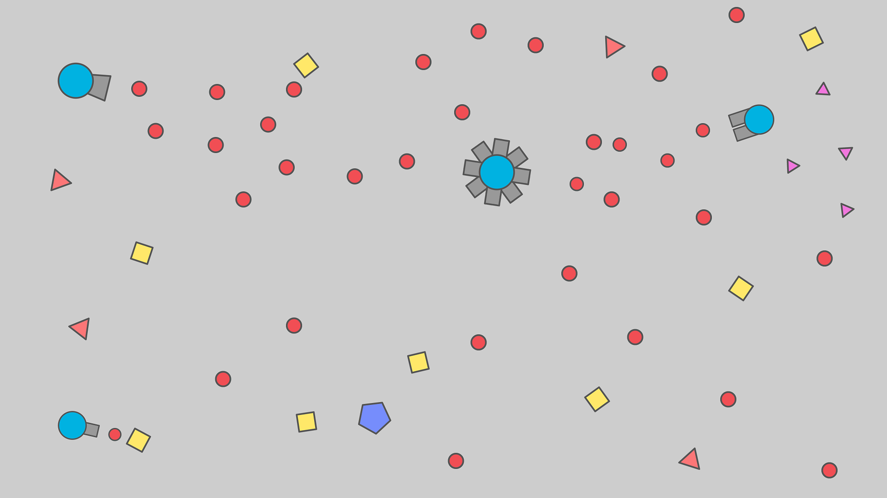

= tienk.io

*Mechanics*:    Player controls tank, that shoots in other players and
                shapes. For destroying players or shapes player gets
                points, that can be used for upgrading tank or purchasing
                new tanks. +
*Genre*:        Shooter, Evolution +
*Setting*:      Abstract +
*Platform*:     Web, Mobile, PC (Maybe) +
*Monetization*: Nope +
*Audience*:     Those, who play in http://agar.io/[Agar.io],
                http://diep.io/[Diep.io] or other `.io` games. +
*Key features*: +
1. You can play in single-player with bots or in multi-player with players anywhere +
2. Advanced evolution

[[game-design]]
== Game design

[[graphics]]
=== Graphics

Everything consists of simple shapes:

- triangles
- squares
- pentagon
- hexagons
- circles

[NOTE]
Every shape in tienk.io has border. Border is always
+++<code style="color: #FFF; background: #555555">dark grey (#555555)+++

// [[colors]]
// ==== Colors
//
// There're also some simple colors:
//
// [cols=3, options="header"]
// |===
// |Color           |Where it's used                               |Hex value
// |Dark grey       |border color                                  |#555555
// |Light grey      |gun color, bullets of bosses                  |#999999
// |Light blue      |blue team, player tank                        |#1DB3DF
// |Light Brown     |brown team                                    |#D48067
// |Green           |green team                                    |#24DF73
// |Light green     |extra rare shapes                             |#8DF571
// |Blue            |pentagons                                     |#7790F9
// |Yellow          |yellow team, squares, Arena Closers, Summoner |#FEE869
// |Light orange    |Necromancer's squares                         |#FBC27C
// |Pink            |crashers, Guardian of the Pentagons           |#EE7BDA
// |Purple          |purple team                                   |#BE83F2
// |Red             |red team, enemy tanks                         |#EE5058
// |Light red       |Defender                                      |#FA777A
// |Very light grey |Fallen Booster, Fallen Overlord               |#C0C0C0
// |===

[[music]]
=== Music

There's no music.

[[start-screen]]
=== Start screen

When player opens game, start screen is displayed.

.Start screen layout
[cols=3]
|===
| Changlelog with changes and date of the lastest update (_top left_)
| some buttons for selecting <<Gamemodes,gamemode>> (_top_)
| _top right_

.2+| _left_
| field for nickname (_middle top_)
.2+| _right_

| start button (_middle bottom_)

| _bottom left_
| _bottom_
| _bottom right_
|===

[NOTE]
If nickname field is focused and player presses `Enter`, game also
starts. If player don't enter nickname, player's nickname will be
`An unnamed tank`. Start screen has its own background image.

[[death-screen]]
=== Death screen

When player's tank is destroyed, death screen is displayed. Death screen
has background of start screen, and it's displayed in the middle. Here's
layout of death screen:

[cols=2]
|===
2+| Label `You were killed by:`
2+| Who killed player

| Score label
.3+| Your tank

| Level label
| Time alive
|===

[[game-field]]
=== Game field

Game field is grid, where cells are grey and lines are a little lighter.

[[tanks]]
=== Tanks

Tank consists from:

1. *body* - circle. Border is circle for most tanks and hexagon for
   <<Smasher,Smashers>>. Color of body depends on team. If you play
   in single-player gamemode, your tank is
   +++<code style="color: #FFF; background: #1D83DF">light blue (#1D83DF)</code>+++
   and other tanks are
   +++<code style="color: #FFF; background: #FA777A">light red (#FA777A)</code>+++.
2. *guns* - +++<code style="color: #FFF; background: #999999">light grey (#999999)</code>+++
   rectangles, see <<Guns>>.
3. *turret* (_optional_) - small
   +++<code style="color: #FFF; background: #999999">light grey (#999999)</code>+++
   circle with gun on top of tank.

[[stats]]
==== Stats

All tanks have some stats. Each stat has its color. Here's full list
of stats and their colors:

- +++<code style="color: #000; background: #EEB790">Health regeneration (#EEB790)</code>+++
- +++<code style="color: #FFF; background: #EC6CF0">Max health (#EC6CF0)</code>+++
- +++<code style="color: #FFF; background: #9A6CF0">Body damage (#9A6CF0)</code>+++
- +++<code style="color: #FFF; background: #6C96F0">Bullet speed (#6C96F0)</code>+++
- +++<code style="color: #000; background: #F0D96C">Bullet penetration (#F0D96C)</code>+++ (could be called _Bullet health_)
- +++<code style="color: #FFF; background: #F06C6C">Bullet damage (#F06C6C)</code>+++
- +++<code style="color: #000; background: #98F06C">Reload (#98F06C)</code>+++
- +++<code style="color: #000; background: #6CF0EC">Movement speed (#6CF0EC)</code>+++
- `Recoil` (_hidden_)
- `Field` of view (_hidden_)

.Upgrade levels
[cols=9, options='header']
|===
| Level | Health regeneration | Max health             | Body damage (Damage per hit) | Bullet speed | Bullet penetration | Bullet damage | Reload | Movement speed
| 0     | TODO                | 100% health            | 3 HP                         | TODO         | TODO               | TODO          | TODO   | TODO
| 1     | TODO                | 125% health (+25%)     | 4 HP                         | TODO         | TODO               | TODO          | TODO   | TODO
| 2     | TODO                | 137.5% health (+12.5%) | 5 HP                         | TODO         | TODO               | TODO          | TODO   | TODO
| 3     | TODO                | 150% health (+12.5%)   | 6 HP                         | TODO         | TODO               | TODO          | TODO   | TODO
| 4     | TODO                | 162.5% health (+12.5%) | 7 HP                         | TODO         | TODO               | TODO          | TODO   | TODO
| 5     | TODO                | 175% health (+12.5%)   | 8 HP                         | TODO         | TODO               | TODO          | TODO   | TODO
| 6     | TODO                | 187.5% health (+12.5%) | 9 HP                         | TODO         | TODO               | TODO          | TODO   | TODO
| 7     | TODO                | 212.5% health (+25%)   | 10 HP                        | TODO         | TODO               | TODO          | TODO   | TODO
|===

[[upgrade-menu]]
===== Upgrade menu

In the bottom left corner there's **upgrade menu**. Stats can be upgraded
using **upgrade points** in this menu. Upgrade points are added for each
<<Levels,level>>. Count of upgrade points is displayed near menu.

Upgrade menu contains all non-hidden stats. Maximum upgrade level for each
stat is 7. Menu consists from bars with rounded corners for each stat.
Each stat has its color, and bar has color of stat. There's a button
for upgrading stat near each bar. If there're no upgrade points, these
buttons are disabled.

[[levels]]
==== Levels

Each player has its score in every gamemode. Score can be earned for
destroying shapes and other players.

[[guns]]
==== Guns

Guns are +++<code style="color: #FFF; background: #999999">light grey (#999999)</code>+++
rectangles. There're some types of guns:

- Simple guns
- Machine guns

[[player]]
=== Player

[[controls]]
==== Controls

Tank rotates towards mouse pointer. Tank can be moved using `WASD`
keys or arrows.

Tank shoots bullets, which have color of tank's body. Bullets are
circles with size of gun.
